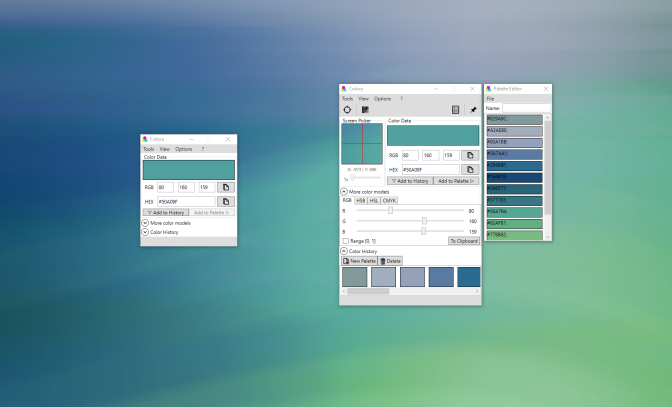

# Colora

[](https://github.com/bluegrams/colora/blob/master/LICENSE.txt)
[](https://github.com/bluegrams/colora)
[](https://sourceforge.net/projects/colora/files/)

> Color converter, screen color picker and color palettes for Windows

[](https://sourceforge.net/projects/colora/files/)

Colora is a useful small color converter and screen color picker tool for Windows. Colora makes it easy to pick colors from screen and save them.
The color picker is tested to work with Windows 10 and DPI scaling. Picked colors can be configured and converted between various formats such as
RGB, Hex, HSB and HSL. The integrated palette tool then allows you to create color palettes from selected colors or the history of picked colors.

<p align="center">

</p>

## Features

- Precisely pick colors from screen using the included screen picker with zoom

- Convert any color between RGB <-> HEX <-> HSB <-> HSL and to CMYK

- Create custom color palettes and save them for later usage

- Export color palettes to GIMP

- Automatic history of last colors picked from screen

- Pin to top and minimal size mode for handier usage

## Setup and Usage

#### Requirements

Colora requires Windows 7 or newer and .NET Framework v.4.6 or higher.

#### Installation

- Download the [latest release from SourceForge](https://sourceforge.net/projects/colora/files/)

or

- Install from [Chocolatey](https://chocolatey.org):
```
choco install colora
```

## Version History

Read [the changelog](https://github.com/bluegrams/colora/blob/master/Changelog.md) to see changes in each version.

## Feedback and Support

_Please leave a feedback on [Sourceforge](https://sourceforge.net/p/colora/reviews) and
	recommend Colora (e.g. on [AlternativeTo](https://alternativeto.net/software/colora/)) if you like it. Thank you!_

Places to get help:

- Ask on [Sourceforge](https://sourceforge.net/p/colora/discussion/) (General help, ideas etc.)
- Open an issue on [GitHub](https://github.com/bluegrams/colora/issues) (Bugs, feature requests etc.)

## Contribute

You are very welcome to contribute fixes and new features by opening a
[pull request on GitHub](https://github.com/bluegrams/colora/pulls).

## License

This software is published under [BSD 3-Clause license](LICENSE.txt) by Bluegrams.
